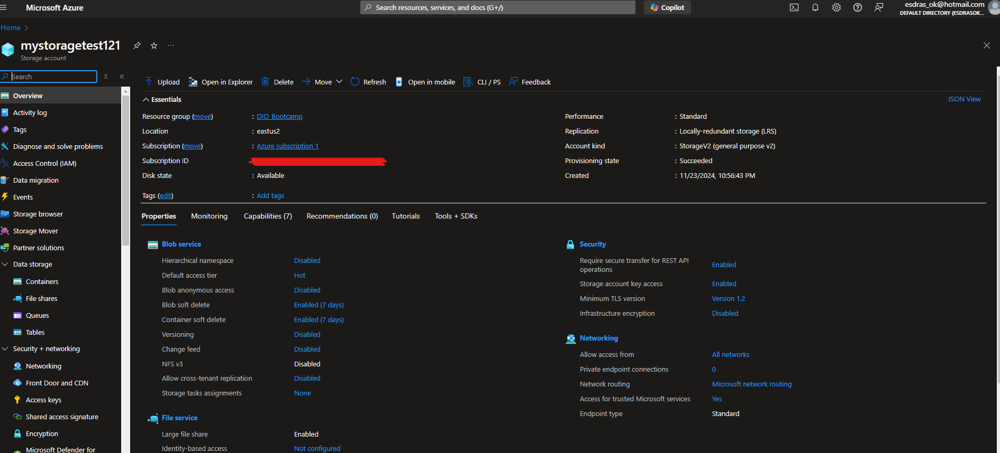
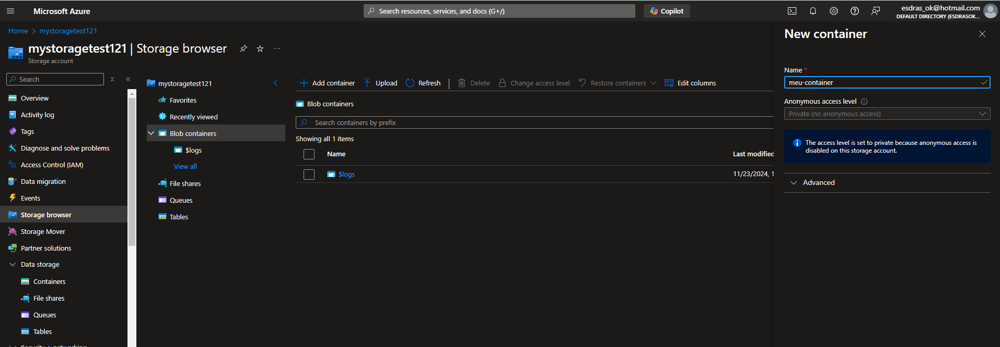
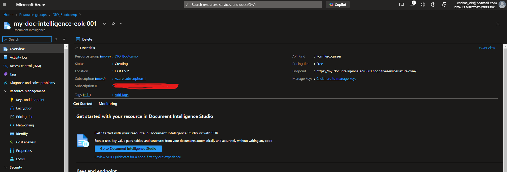
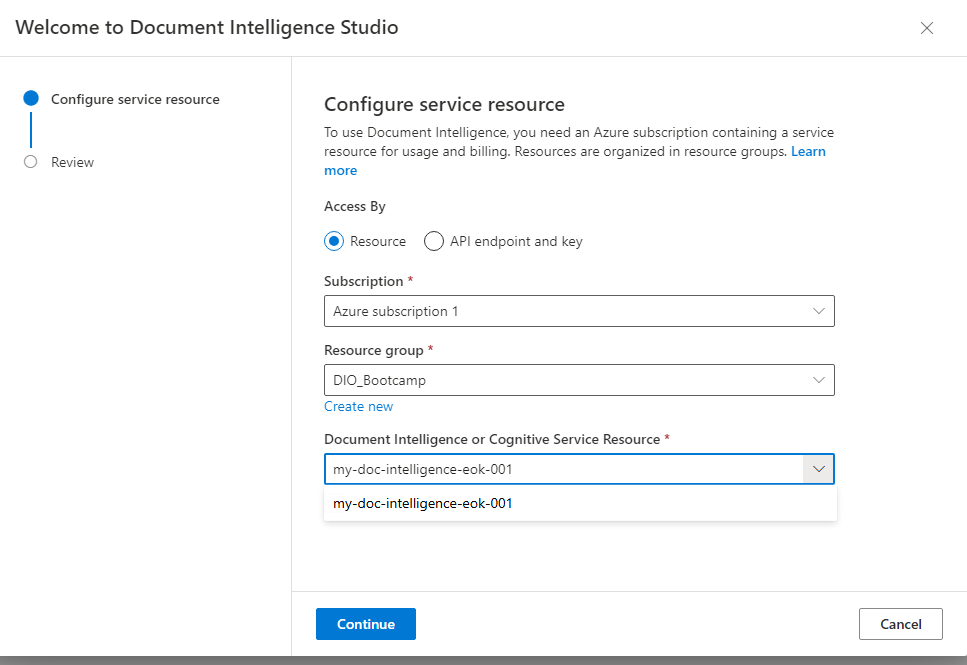
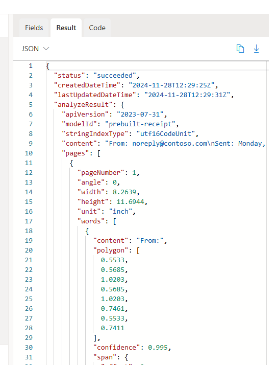

# Image Gallery 

Todos os passos do bootcamp foram seguidos.
## Images 
1. Criei o recurso de armazenamento  
2. Criar um container de blob storage  
3. Permitir acesso a Blobs de forma anônima  
4. Cirei o Document Intelligence  
5. Criei no Document Intelligence Portal o recurso de leitura de receipts  
6. Utilizei o recurso para ler recibo e obter dados em JSON  
7. Rodando e chamando o nosso recurso! 
8. Baixando as libs 
9. Rodando pelo azure openAi 
10. Conversando com o OpenAI definindo o systema e o usuário 