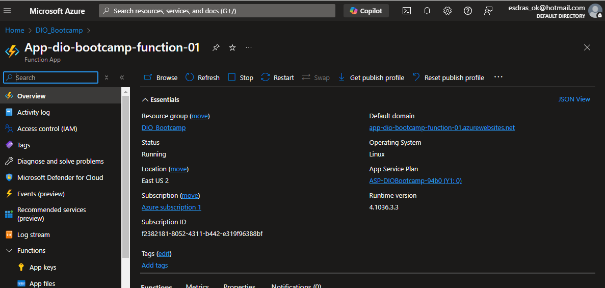
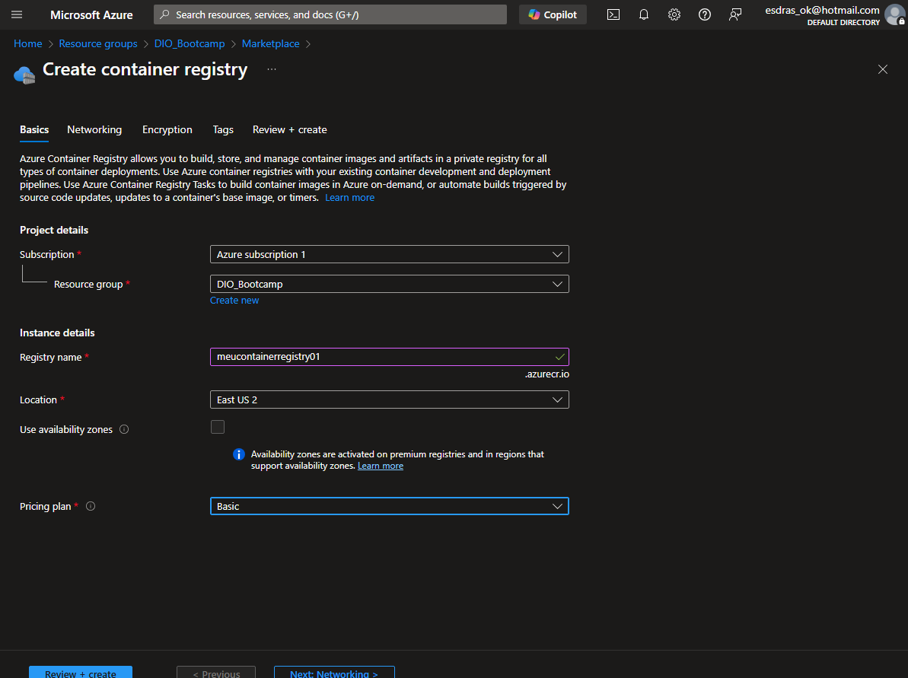

# Como fazer o deploy de uma API na Nuvem na Prática

JSON e código criados com o auxílio do ChatGPT

## Dados mockados de previsão do tempo (arquivo json):

Arquivo "weatherData.json"
```
{
  "2025-02-03": { "celsius": 25, "clima": "Ensolarado" },
  "2025-02-04": { "celsius": 22, "clima": "Nublado" },
  "2025-02-05": { "celsius": 18, "clima": "Chuvoso" },
  "2025-02-06": { "celsius": 20, "clima": "Parcialmente nublado" },
  "2025-02-07": { "celsius": 24, "clima": "Ensolarado" },
  "2025-02-08": { "celsius": 19, "clima": "Chuvoso" },
  "2025-02-09": { "celsius": 21, "clima": "Nublado" },
  "2025-02-10": { "celsius": 26, "clima": "Ensolarado" },
  "2025-02-11": { "celsius": 23, "clima": "Parcialmente nublado" },
  "2025-02-12": { "celsius": 18, "clima": "Chuvoso" },
  "2025-02-13": { "celsius": 22, "clima": "Nublado" },
  "2025-02-14": { "celsius": 25, "clima": "Ensolarado" },
  "2025-02-15": { "celsius": 20, "clima": "Parcialmente nublado" },
  "2025-02-16": { "celsius": 17, "clima": "Chuvoso" },
  "2025-02-17": { "celsius": 21, "clima": "Nublado" },
  "2025-02-18": { "celsius": 26, "clima": "Ensolarado" },
  "2025-02-19": { "celsius": 19, "clima": "Chuvoso" },
  "2025-02-20": { "celsius": 22, "clima": "Parcialmente nublado" },
  "2025-02-21": { "celsius": 24, "clima": "Ensolarado" },
  "2025-02-22": { "celsius": 18, "clima": "Nublado" },
  "2025-02-23": { "celsius": 20, "clima": "Parcialmente nublado" },
  "2025-02-24": { "celsius": 25, "clima": "Ensolarado" },
  "2025-02-25": { "celsius": 17, "clima": "Chuvoso" },
  "2025-02-26": { "celsius": 21, "clima": "Nublado" },
  "2025-02-27": { "celsius": 23, "clima": "Parcialmente nublado" },
  "2025-02-28": { "celsius": 26, "clima": "Ensolarado" }
}

```

## API simple sde previsão do tempo (dados mockados):

```
const express = require("express");
const fs = require("fs");
const app = express();
const port = 3000;

// Carregar dados do arquivo JSON
const weatherData = JSON.parse(fs.readFileSync("weatherData.json", "utf-8"));

app.get("/previsao", (req, res) => {
  const { dia } = req.query;
  
  if (!dia) {
    return res.status(400).json({ erro: "Por favor, forneça um dia no formato YYYY-MM-DD." });
  }
  
  const previsao = weatherData[dia] || { celsius: "Desconhecido", clima: "Sem dados" };
  res.json(previsao);
});

app.listen(port, () => {
  console.log(`Servidor rodando em http://localhost:${port}`);
});
```

## DockerFile:

```
FROM node:18

# Define o diretório de trabalho dentro do contêiner
WORKDIR /app

# Copia os arquivos necessários para o contêiner
COPY package*.json ./

# Instala as dependências do projeto
RUN npm install

# Copia os demais arquivos do projeto
COPY . .

# Expõe a porta da aplicação
EXPOSE 3000

# Comando para rodar a aplicação
CMD ["node", "index.js"]
```

## API de função no Azure

A API da Function criada inicialmente:  

## Criação do Container Registry

As configurações de acesso do Container Registry:  