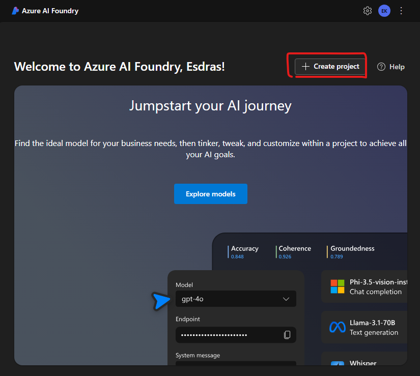
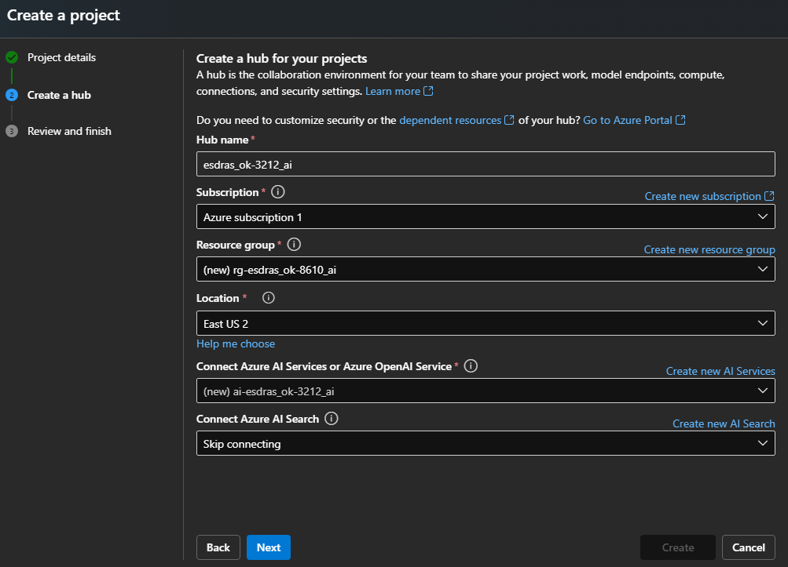
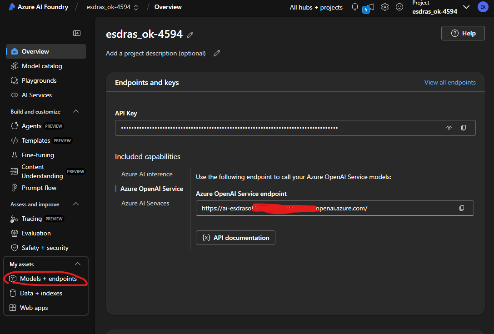
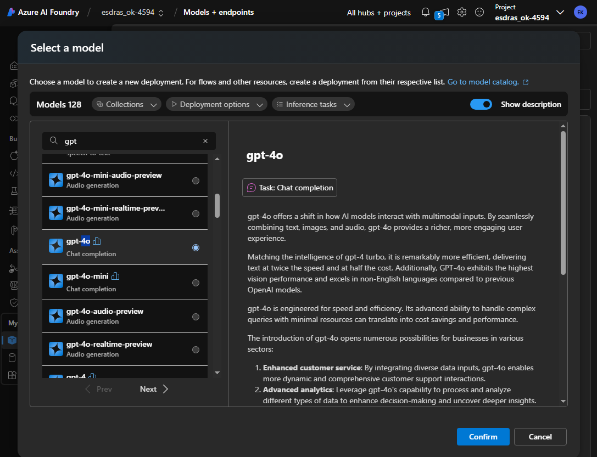
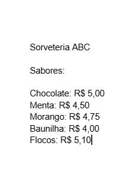
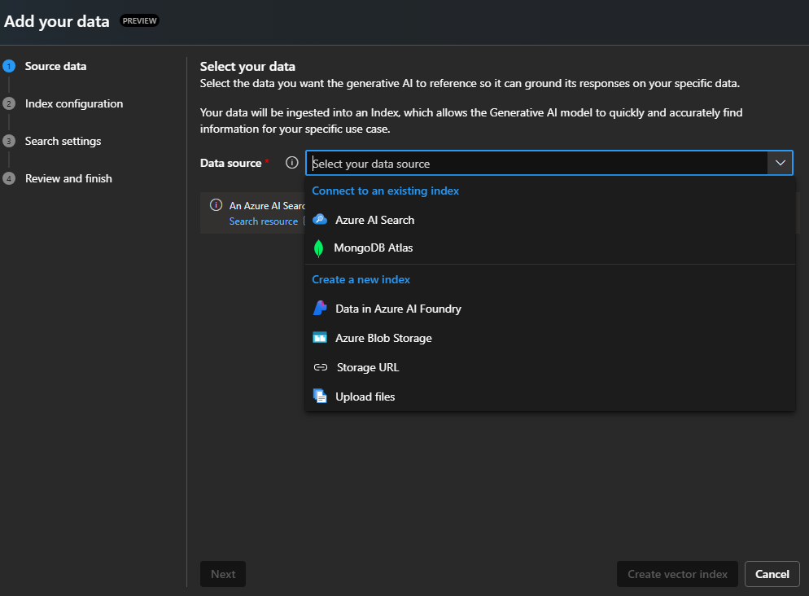
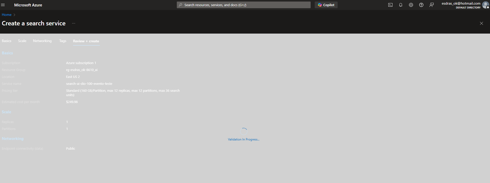
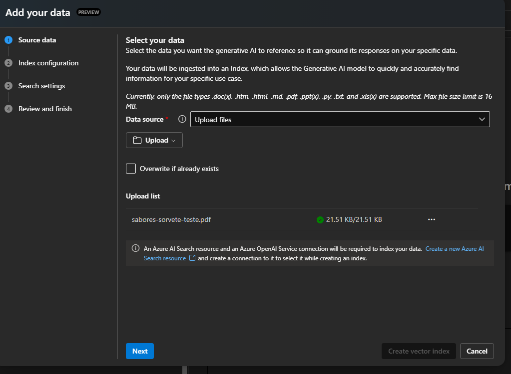
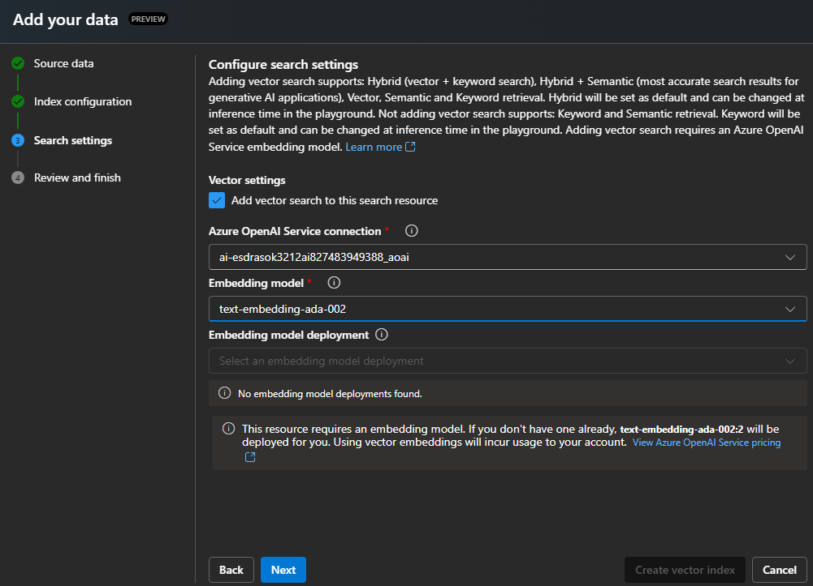
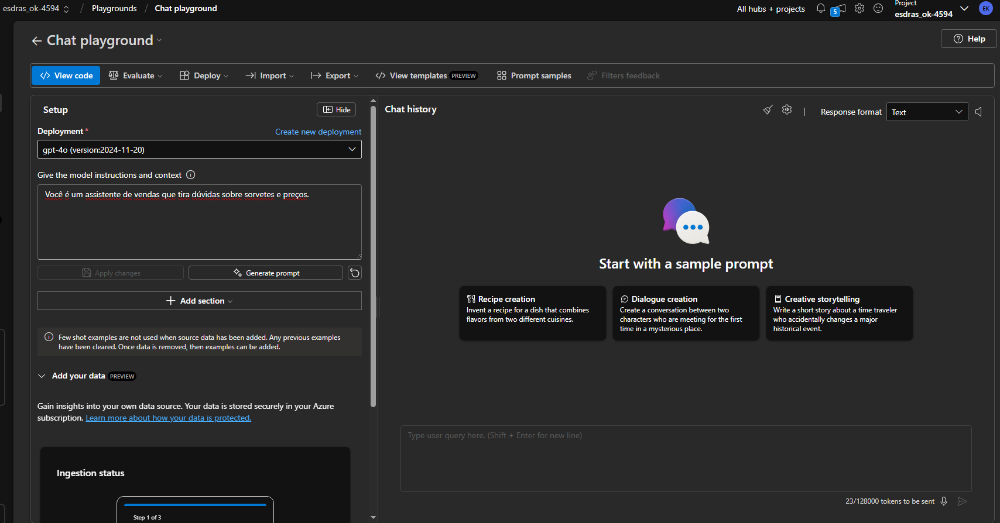

# Desenvolvimento do chatbot no Azure Foundry com RAG usando PDF com dados vetorizados #

## Passos para criação de seu modelo com dados de apoio

1 - Crie um novo projeto no Azure Foundry:  
2 - Escolhe as características de seu projeto:  
3 - Esper a a finalização de seu projeto:  
4 - Clique em Model + endpoint para escolhermos nosso modelo:  
5 - Escolha o modelo, neste caso gpt-4o:  
6 - Crie seu documento PDF a ser utilizado no modelo:  
7 - Adicione dados via o Azure Search:  
8 - Cria o Azure Search:  
9 - Adiciona o documento:  
10 - Seleciona os recursos necessários:  
11 - Adicione a mensagem de sistema e use o modelo:  