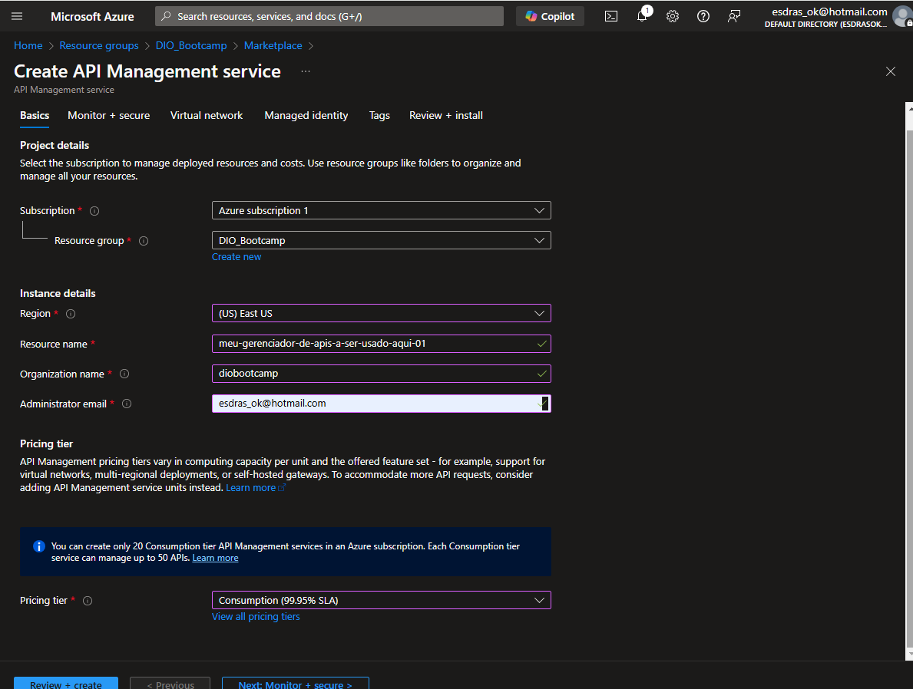
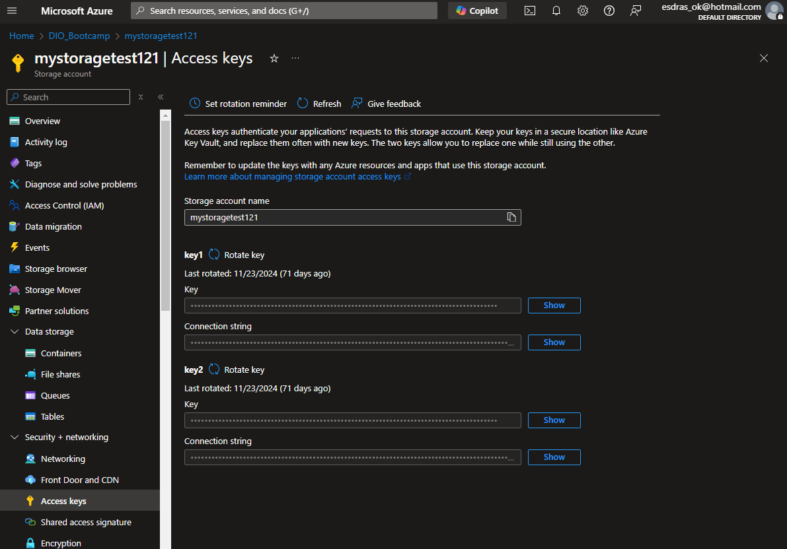

# Criação de Gerenciados de Catálogos da Netflix com Azure Functions e Banco de Dados

## Criando Infra:

Parâmetros de criação do gerenciador de APIs:
 

## Configuração da classe:

Código criado com auxílio do ChatGPT:
```
const { CosmosClient } = require('@azure/cosmos');
const { BlobServiceClient } = require('@azure/storage-blob');
const multiparty = require('multiparty');
const { v4: uuidv4 } = require('uuid');

const cosmosEndpoint = process.env.COSMOS_DB_ENDPOINT;
const cosmosKey = process.env.COSMOS_DB_KEY;
const databaseId = "VideosDB";
const containerId = "Videos";
const client = new CosmosClient({ endpoint: cosmosEndpoint, key: cosmosKey });
const container = client.database(databaseId).container(containerId);

const blobServiceClient = BlobServiceClient.fromConnectionString(process.env.AZURE_STORAGE_CONNECTION_STRING);
const blobContainerClient = blobServiceClient.getContainerClient("videos");

module.exports = async function (context, req) {
    switch (req.method) {
        case "POST":
            await uploadVideo(context, req);
            break;
        case "GET":
            await listVideos(context, req);
            break;
        default:
            context.res = { status: 405, body: "Método não permitido" };
    }
};
```

## Upload de vídeo blob para o cosmos DB:
```
async function uploadVideo(context, req) {
    const form = new multiparty.Form();
    
    try {
        const { fields, files } = await new Promise((resolve, reject) => {
            form.parse(req, (err, fields, files) => {
                if (err) reject(err);
                else resolve({ fields, files });
            });
        });
        
        const videoFile = files.video[0];
        const blobName = uuidv4() + "-" + videoFile.originalFilename;
        const blockBlobClient = blobContainerClient.getBlockBlobClient(blobName);
        
        const stream = fs.createReadStream(videoFile.path);
        await blockBlobClient.uploadStream(stream, videoFile.size);
        
        const metadata = {
            "nome-filme": fields["nome-filme"] ? fields["nome-filme"][0] : "Desconhecido",
            "genero": fields["genero"] ? fields["genero"][0] : "Desconhecido"
        };
        
        const metadataBlobName = blobName + "-metadata.json";
        const metadataBlobClient = blobContainerClient.getBlockBlobClient(metadataBlobName);
        await metadataBlobClient.upload(JSON.stringify(metadata), JSON.stringify(metadata).length);
        
        const videoMetadata = {
            id: uuidv4(),
            filename: videoFile.originalFilename,
            contentType: videoFile.headers['content-type'],
            size: videoFile.size,
            uploadDate: new Date().toISOString(),
            blobUrl: blockBlobClient.url,
            metadataBlobUrl: metadataBlobClient.url,
            nomeFilme: metadata["nome-filme"],
            genero: metadata["genero"]
        };
        
        await container.items.create(videoMetadata);
        context.res = { status: 201, body: "Vídeo e metadados salvos com sucesso" };
    } catch (error) {
        context.res = { status: 500, body: "Erro ao salvar vídeo: " + error.message };
    }
}
```

## Filtragem genero

```
async function listVideosByGenre(context, req) {
    const genero = req.query.genero;
    const querySpec = {
        query: "SELECT * FROM c WHERE c.genero = @genero",
        parameters: [{ name: "@genero", value: genero }]
    };
    
    try {
        const { resources } = await container.items.query(querySpec).fetchAll();
        context.res = { status: 200, body: resources };
    } catch (error) {
        context.res = { status: 500, body: "Erro ao listar vídeos por gênero: " + error.message };
    }
}
```

## Listando todos os elementos:

```
async function listVideos(context, req) {
    const querySpec = {
        query: "SELECT * FROM c"
    };
    
    try {
        const { resources } = await container.items.query(querySpec).fetchAll();
        context.res = { status: 200, body: resources };
    } catch (error) {
        context.res = { status: 500, body: "Erro ao listar vídeos: " + error.message };
    }
}
```

## Autorização de acesso à bd

As credenciais de acesso podem ser obtidas em "Access Keys"  