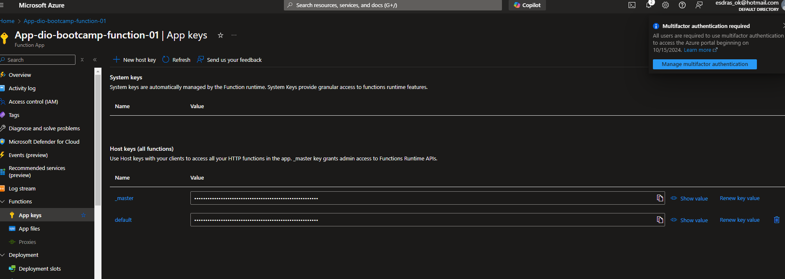

# Criação de CPF em Node.js

## código de validação de cpf:
```
function validarCPF(cpf) {
    cpf = cpf.replace(/[^\d]/g, ''); // Remove caracteres não numéricos
    if (cpf.length !== 11 || /^(\d)\1{10}$/.test(cpf)) return false;
    
    let soma = 0, resto;
    
    for (let i = 1; i <= 9; i++) {
        soma += parseInt(cpf.charAt(i - 1)) * (11 - i);
    }
    resto = (soma * 10) % 11;
    if (resto === 10 || resto === 11) resto = 0;
    if (resto !== parseInt(cpf.charAt(9))) return false;
    
    soma = 0;
    for (let i = 1; i <= 10; i++) {
        soma += parseInt(cpf.charAt(i - 1)) * (12 - i);
    }
    resto = (soma * 10) % 11;
    if (resto === 10 || resto === 11) resto = 0;
    if (resto !== parseInt(cpf.charAt(10))) return false;
    
    return true;
}
```

## código de recebimento e envio:
```
const readline = require('readline');
const rl = readline.createInterface({
    input: process.stdin,
    output: process.stdout
});

rl.question('Digite um CPF para validar: ', (cpf) => {
    if (validarCPF(cpf)) {
        console.log('Esse CPF é válido');
    } else {
        console.log('Esse CPF é inválido');
    }
    rl.close();
});
```

## Autorização 

A API criada necessita de autenticação, que pode ser obtida no seguinte local:
 