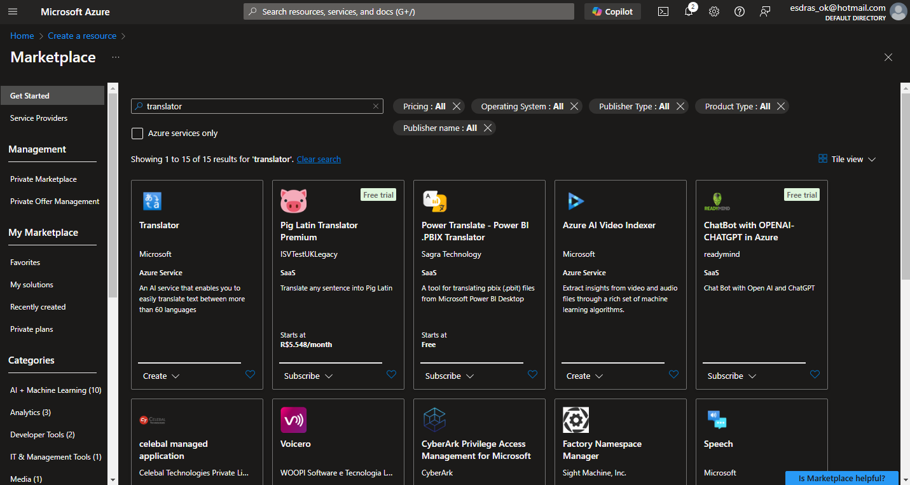
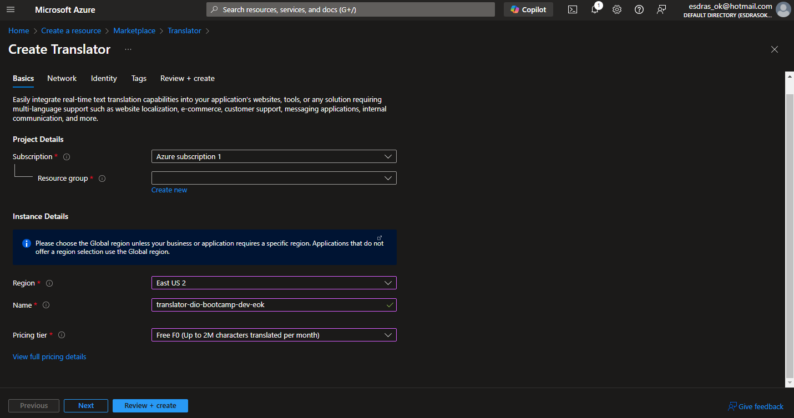
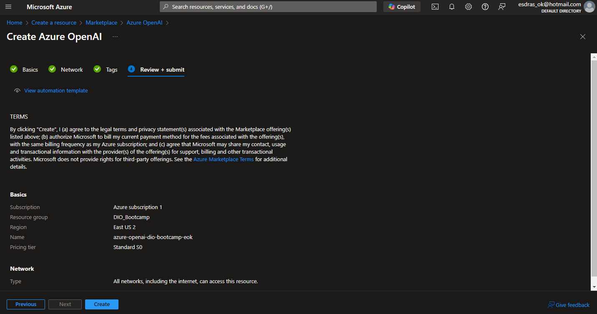
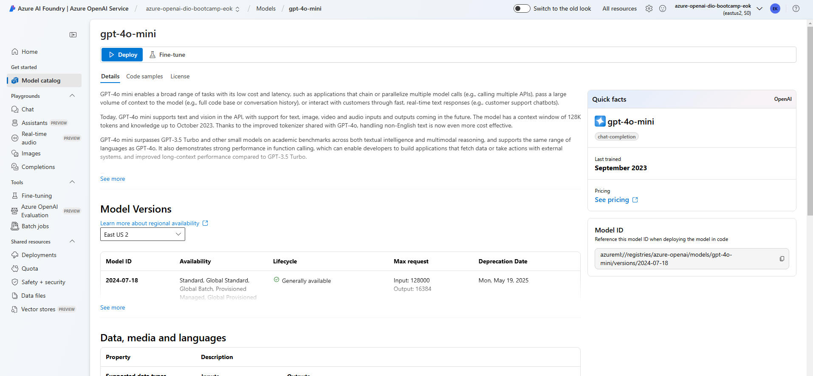
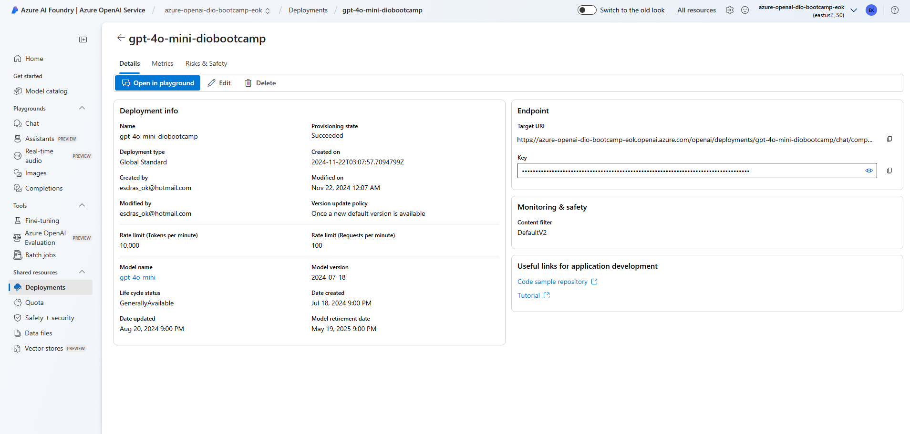
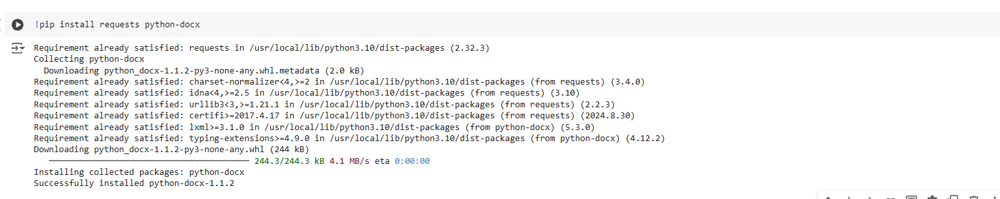
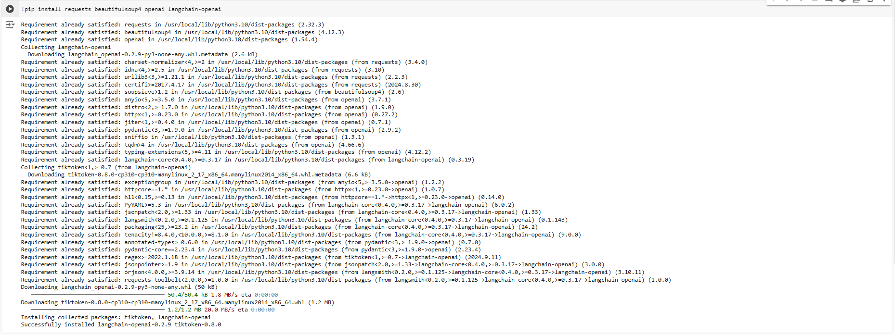
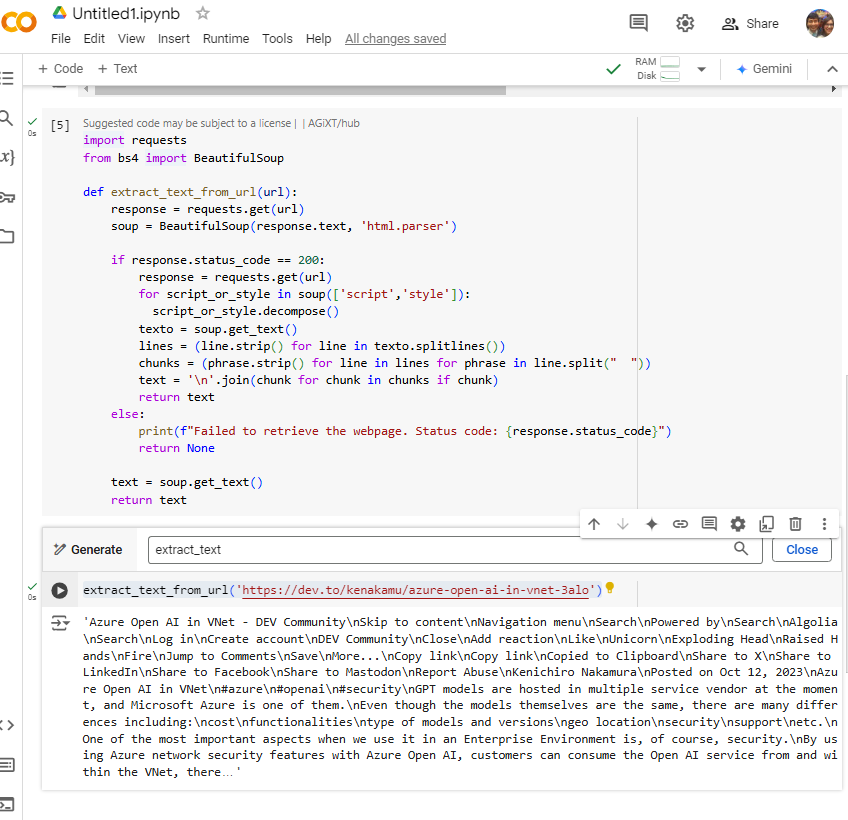

# Image Gallery 

Todos os passos do bootcamp foram seguidos.
## Images 
1. Criei o recurso 'translator'  
2. Detalhes da criação  
3. Criando recurso Azure OpenAI  
4. Crieo o gpt-4o-mini  
5. Detalhes de nosso gpt-4o-mini  
6. Instalando pacotes  
7. Rodando e chamando o nosso recurso! 
8. Baixando as libs 
9. Rodando pelo azure openAi 