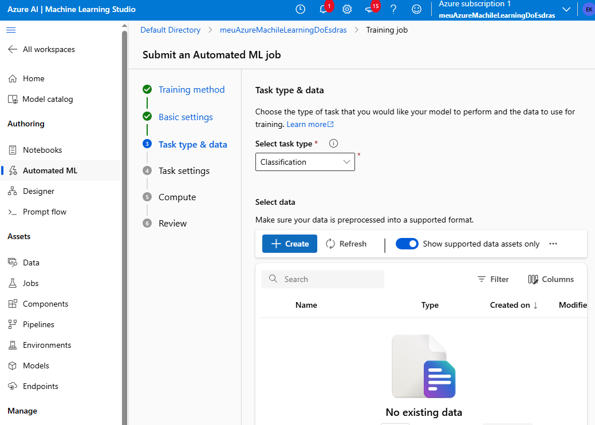

# Criando ML #

## Passos para criação conforme tutoriaL

1 - Crie seu recurso do Azure Machine Learning  
2 - Ele criará o azureVaultKey, storage, e Azure Insights:  
3 - Entre no Machine Learning Studio:  
4 - Adiciona os dados (estou usando o dataset de iris que é bem simples):  
5 - Cria o classificador:  
6 - Seleciona o dataset:  
7 - Crie o modelo:  

Pronto, você tem o seu modelo e pode usá-lo como quiser. Ele vai treinar e logo poderá ser utilizado.